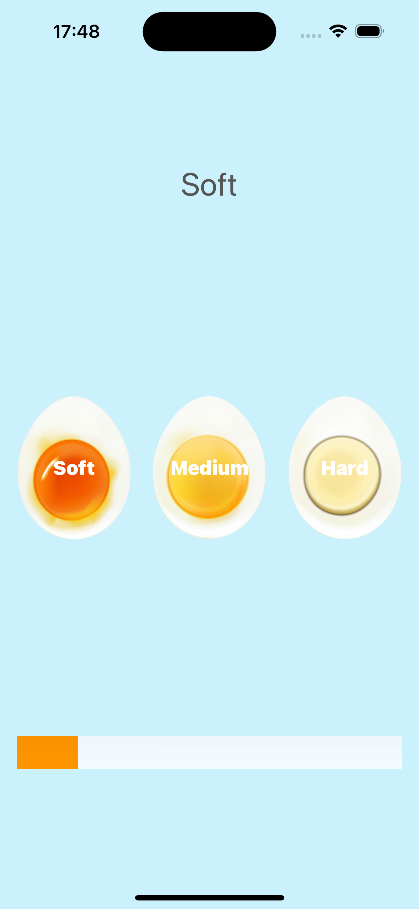
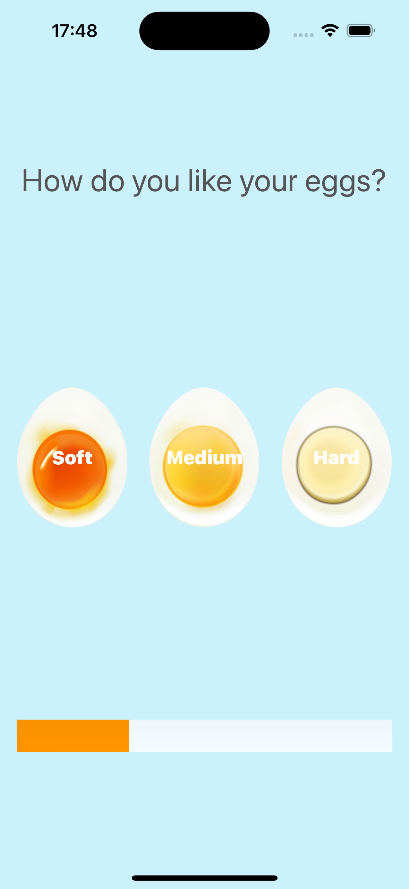

# EggTimer App

EggTimer is a simple iOS app built using Swift and Xcode. It helps you cook the perfect egg by allowing you to choose between Soft, Medium, or Hard-boiled eggs. The app then starts a timer for the appropriate duration needed for the selected egg type to stay in boiling water.

## Features

- **Soft Egg Timer**: Perfectly timed for a soft-boiled egg.
- **Medium Egg Timer**: Ideal for a medium-boiled egg.
- **Hard Egg Timer**: Get a fully cooked hard-boiled egg every time.

## Screenshots

Here are some screenshots of the app:

## Installation

1. Clone the repository to your local machine.
2. Open the project in Xcode.
3. Build and run the app on your iOS device or simulator.

## Usage

1. Open the EggTimer app.
2. Choose the desired egg type: Soft, Medium, or Hard.
3. The timer will start automatically for the selected egg type.
4. Wait until the timer finishes and enjoy your perfectly cooked egg!

## Requirements

- iOS 13.0+
- Xcode 11.0+
- Swift 5.0+

## License

This project is licensed under the MIT License - see the [LICENSE](LICENSE) file for details.